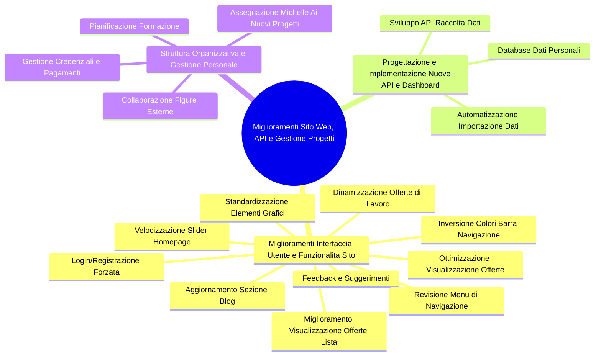

# Job_Courier — Marketplace Platform Guide

**Parent:** ../../claude.md  
**Category:** Website Development > Marketplace  
**Status:** 🔴 CRITICAL - Active Development  
**Updated:** 2026-04-13  
**Model:** Haiku 4.5 (default) | Sonnet 4.6 (architecture/debug)  
**Budget:** 50,000 tokens/session (highest allocation)

---

## ⚡ Quick Summary

**What:** Job marketplace with filtering, search, and job matching  
**Where:** React app with git tracking, multiple meeting notes, video recordings  
**Why Critical:** Urgent deadline (meetings from March 27, April 10), complex filtering logic  
**Challenge:** Token explosion from filter combinations + sequential API calls

---

## 🎯 Critical Token Optimizations

### Problem 1: Filter Combinations

**Current cost:** 3,000 tokens/session per filter change (re-evaluate all combinations)

**Solution:**
```
1. Cache filter combinations
   - Key: JSON.stringify(filters)
   - Store: React state + localStorage
   - TTL: Until new job posted (WebSocket)

2. Only pass changed filters to API
   - Not: Full filters object
   - Yes: Diff of what changed
   
3. Batch similar filters together
   - Not: location, then salary, then role (3 API calls)
   - Yes: All 3 at once (1 API call)
```

**Savings:** -2,000 to -3,000 tokens/session

---

### Problem 2: Search Input Debounce

**Current cost:** 500+ tokens per keystroke (API call on every change)

**Solution:**
```javascript
// WRONG: API call per keystroke
const handleSearch = (e) => {
  setSearch(e.target.value);  // Triggers useEffect → API call
}

// RIGHT: Debounce 500ms
const [search, setSearch] = useState('');
const debouncedSearch = useDebounce(search, 500);

useEffect(() => {
  if (debouncedSearch) {
    callSearchAPI(debouncedSearch);
  }
}, [debouncedSearch]);
```

**Savings:** -1,000 to -1,500 tokens/session

---

### Problem 3: Pagination

**Current cost:** 2,000+ tokens if loading all 1,000 jobs at once

**Solution:**
```
1. Load 20 jobs initially
2. Load 20 more on scroll
3. Store in state (not re-fetch unless filters change)

Savings: Only transmit jobs shown to user
```

**Savings:** -1,000 to -1,500 tokens/session

---

### Problem 4: Sequential API Calls

**Current:** Apply filter → Wait → Get results → Show loading  
**Better:** Parallel calls if possible

**Savings:** -500 tokens/session

---

**Total potential savings:** -5,500 tokens/session (11% reduction from budget)

---

## 📊 Token Budget Allocation

| Component | Budget | Details |
|-----------|--------|---------|
| **Filtering logic** | 15,000 | Complex matching algorithm |
| **Search + pagination** | 10,000 | Typeahead, results, infinite scroll |
| **Matching algorithm** | 12,000 | Job recommendations |
| **UI/UX improvements** | 8,000 | Components, styling |
| **Testing** | 3,000 | Test cases, validation |
| **Buffer** | 2,000 | Emergency optimizations |

---

## 🏗️ Architecture Overview

```
Job_Courier/
├── src/
│   ├── components/
│   │   ├── JobList.tsx (main results + infinite scroll)
│   │   ├── FilterBar.tsx (filters with caching)
│   │   ├── JobCard.tsx (individual job display)
│   │   ├── SearchBox.tsx (debounced search)
│   │   └── Filters_old.jsx (legacy, replace)
│   │
│   ├── pages/
│   │   ├── Browse.tsx (job listing page)
│   │   ├── [jobId].tsx (job detail)
│   │   └── MyApplications.tsx (user's applications)
│   │
│   ├── hooks/
│   │   ├── useFilters.ts (filter cache logic) ← CRITICAL
│   │   ├── useSearch.ts (debounced search)
│   │   └── useJobMatching.ts (matching algorithm)
│   │
│   └── utils/
│       └── cacheManager.ts (filter cache)
│
├── api/
│   └── /jobs (job search + filtering)
│
└── .git/ (active development tracking)
```

---

## 🔍 Decision Tree: Job_Courier Specific

Before EVERY tool call:

```
1. Touching filter logic?
   → Check cache strategy
   → Verify debounce in place
   → Look for batch API opportunities

2. Adding search feature?
   → Implement debounce first
   → Then API call
   → Then display

3. Performance issue?
   → Chrome DevTools Network tab (find slow endpoint)
   → React Profiler (find re-renders)
   → Show timing data before asking for fix

4. Token budget exceeded?
   → Aggressive: Reduce scope to core features
   → Defer: Nice-to-have features to next session
   → Optimize: Use ANTI_PATTERNS.md to find savings
```

---

## 🚀 Urgent Fixes (Priority Order)

### P0: Filter Caching
**Impact:** -3k tokens/session  
**Effort:** Medium  
**Status:** Not implemented  
**Action:** Implement useFilters hook with localStorage

### P1: Search Debounce  
**Impact:** -1.5k tokens/session  
**Effort:** Low  
**Status:** Maybe partial (old Filters component?)  
**Action:** Add debounce to SearchBox

### P2: Pagination
**Impact:** -1.5k tokens/session  
**Effort:** Medium  
**Status:** Unclear (check old component)  
**Action:** Implement infinite scroll in JobList

### P3: Parallel APIs
**Impact:** -0.5k tokens/session  
**Effort:** Low  
**Status:** Unknown  
**Action:** Use Promise.all for parallel calls

---

## 📝 Recap Riunioni e Feedback Relatore

### Contenuto chiave 1: Miglioramenti Interfaccia Utente e Funzionalità Sito
*Punto principale: Il relatore ha fornito feedback e suggerimenti per migliorare l'esperienza utente e l'estetica del sito web.*
1. **Inversione Colori Barra Navigazione:** Inversione dei colori della barra di navigazione e dello sfondo, rendendo la barra bianca e lo sfondo un grigio diverso da quello attuale.
2. **Dinamizzazione Offerte di Lavoro:** Rendere la lista di offerte di lavoro più interattiva e coinvolgente per gli utenti.
3. **Ottimizzazione Visualizzazione Offerte:** Proposta di layout simile a quello di Indeed, che mantiene la lista delle offerte sulla sinistra e il dettaglio sulla destra, per una navigazione più fluida.
4. **Login/Registrazione Forzata:** Implementare un sistema di login/registrazione forzato dopo un certo numero di visualizzazioni di offerte, per aumentare il numero di candidati registrati.
5. **Revisione Menu di Navigazione:** Includere voci come "Vedi tutte le offerte", "Pubblica il tuo curriculum", "Vedi tutte le aziende" e "Suggerimenti per la carriera", con un'uniformità grafica.
6. **Aggiornamento Sezione Blog:** Dividere i contenuti in "Suggerimenti per la carriera" e "Suggerimenti per il recruiting", con una chiara identificazione e uno stile coerente con il menu.
7. **Miglioramento Visualizzazione Offerte Lista:** Standardizzare dimensioni, allineare elementi e includere informazioni come nome azienda, logo, location, titolo e tag di settore e ruolo.
8. **Standardizzazione Elementi Grafici:** Scegliere un unico stile e colore per tutti i bottoni e gli elementi interattivi.
9. **Velocizzazione Slider Homepage:** Velocizzare lo slider delle immagini nella parte superiore della homepage e aggiungere pallini/frecce direzionali.

### Contenuto chiave 2: Progettazione e implementazione Nuove API e Dashboard
*Punto principale: Il relatore ha espresso la necessità di sviluppare API per la raccolta dati e la creazione di dashboard analitiche.*
1. **Sviluppo API Raccolta Dati:** Creazione di API per la raccolta di dati pubblici, escludendo inizialmente i dati personali, per costruire dashboard che monitorino metriche come il numero di clic, le offerte e i candidati.
2. **Database Dati Personali:** Sviluppo di un database separato per la gestione dei dati personali (conforme al GDPR), come backup e per future analisi più approfondite, pianificando l'implementazione in un secondo momento con un focus sulla sicurezza.
3. **Automatizzazione Importazione Dati:** Automatizzazione dell'importazione dei dati da file CSV forniti tramite FTP, per alimentare le dashboard e garantire un aggiornamento costante delle informazioni.

### Contenuto chiave 3: Struttura Organizzativa e Gestione Personale
*Punto principale: Il relatore ha discusso l'integrazione di nuove risorse nel team e la loro gestione per ottimizzare lo sviluppo dei progetti.*
1. **Assegnazione Michelle ai Nuovi Progetti:** Assegnazione di Michelle ai nuovi progetti, concentrandosi inizialmente sul nuovo sito web e sull'automazione, data la minore urgenza dei tempi.
2. **Pianificazione Formazione:** Pianificazione della formazione per Michelle e Javier, possibilmente in sessioni congiunte per facilitare lo scambio di idee e accelerare il progresso.
3. **Collaborazione Figure Esterne:** Collaborazione con figure esterne per compiti specifici, come la gestione dei social media per BLC e Job Courier.
4. **Gestione Credenziali e Pagamenti:** Sviluppo di un piano per la gestione delle credenziali e dei pagamenti relativi alle nuove piattaforme e servizi.

### 🗺️ Mappa Mentale dei Miglioramenti



---

## 📚 References

- **[PROMPT_ENGINEERING.md](../../PROMPT_ENGINEERING.md)** — Optimize prompts for marketplace features
- **[TOKEN_POLICIES.md](../../TOKEN_POLICIES.md)** — Per-task budgets
- **[ANTI_PATTERNS.md](../../ANTI_PATTERNS.md)** — Marketplace anti-patterns
- **Meeting notes:** "Meeting Gabriele 27 03.txt" + "analisi_Job_Courier.md"
- **SKILL.md** — Product requirements and feature list
- **Video recordings:** Track progress and identify blockers

---

## ✅ Session Checklist

- [ ] Cache strategy enabled for filters
- [ ] Debounce added to search input
- [ ] Pagination working (no loading all jobs)
- [ ] API calls parallelized where possible
- [ ] Token usage tracked (stayed under 50k?)
- [ ] No console.log/debugger in production code
- [ ] Tests written for critical paths
- [ ] **Temp files eliminati** — script `_*_tmp.*`, output intermedi, screenshot diagnostici cancellati a fine sessione

## 🗑️ Temp File Rule

Script Python/JS/Bash per task singolo → **eliminare subito dopo uso**.  
Prefisso `_` = temporaneo = cancellare.  
Asset finali, sorgente React, wiki → conservare.  
Ref: `00_Wiki/concepts/token-optimization.md` § Temporary File Policy

---

**Model:** Haiku 4.5  
**Status:** 🔴 CRITICAL  
**Deadline:** URGENT  
**Last Updated:** 2026-06-25

**Ultimo handoff:** [docs/handoff-2026-06-25.md](docs/handoff-2026-06-25.md)

**🚨 GO-LIVE DOMINIO:** prima di QUALSIASI operazione su DNS, Vercel domains o deploy produzione, leggere [docs/GOLIVE-PLAN.md](docs/GOLIVE-PLAN.md) — mappa infrastruttura verificata (GoDaddy=DNS, Hostpoint=WP vecchio), redirect map obbligatoria (213 URL), playbook errori e rollback. NB: handoff precedenti che dicono "sito live su Vercel" sono errati — produzione è ancora su Hostpoint.

---

## 📋 Notion — Formato Sessioni di Lavoro (OBBLIGATORIO)

**Database:** `collection://6ba19f86-ee14-46b1-b082-7ad1363711f9`  
**Progetto Collegato Job Courier (dev):** `https://www.notion.so/32cfa85c0d0381babb25e98a05c98279`  
**Progetto Collegato Job Courier (generale):** `https://www.notion.so/317fa85c0d0380faa38ecb41059d5e74`

### ⚠️ REGOLA CRITICA — Progetto Collegato (SEMPRE)

Quando crei/aggiorni sessioni Notion per **Job Courier**, il campo `Progetto Collegato` deve essere:
```
"[\"https://app.notion.com/p/317fa85c0d0380faa38ecb41059d5e74\"]"
```
- **Nome progetto:** "Create Job Courier Website"
- **Collection:** `collection://2acfa85c-0d03-81a3-b22f-000b86019b58` (Progetti N8N)
- **Formato:** JSON array stringificato (NON array nativo — causa errore MCP)
- **Se hai dubbi su quale progetto collegare → CHIEDI prima di creare la sessione**

### Struttura ESATTA del contenuto pagina (Notion-flavored Markdown)

```
## 🎯 Obiettivo della sessione
**Conclusione:** [frase singola riassuntiva di cosa è stato fatto e perché]
**📋 Attività svolte:**
- [attività 1]
- [attività 2]
- [attività N]
---
## ✅ Risultati raggiunti
- **[Etichetta breve]:** [descrizione risultato concreto]
- **[Etichetta breve]:** [descrizione risultato concreto]
---
## 📋 Prossimi passi
- [azione futura 1]
- [azione futura 2]
---
## [Sezione specifica opzionale — es. 🗺️ Implementation Plan / 🔍 Logica / 📅 Timeline]
[tabelle, codice, dettagli tecnici]
```

### Regole
- **NO callout block** (`<callout>`) come blocco introduttivo — inizia SEMPRE con `## 🎯`
- **NO `# 🛠️ Dev Log`** come titolo interno — è uno stile vecchio
- Sezioni separate sempre da `---`
- Bullet list con `**Label:**` prefix per risultati
- Tabelle Notion con `<table header-row="true">` solo per implementation plan / timeline / task list
- Proprietà `Minuti Lavorati`: numero intero (es. 120, non "120 minuti")
- Proprietà `Categoria`: uno tra `Sviluppo | Bug Fix | Meeting | Preparazione Corsi | Erogazione corso | Formazione | Debug | Altro`
- Se sessione copre sia sviluppo che meeting → `Categoria: Sviluppo`, dettaglio meeting nella sezione Attività svolte
- Proprietà `Note`: SEMPRE compilare con breve riassunto (1-2 frasi) — stato finale + eventuali pendenze. Non lasciare vuoto.

## 🌐 Lingua

Risposte SEMPRE in italiano. Codice e commit in inglese.
